## Airflow data pipeline to process User data from property hosting website logs

**Project Description**:

An online real-estate company is interested in understanding `user enagagement` by 
analyzing user search patterns to send targeted emails to the users with valid searches. 
A valid search is termed as one where the search metadata contains `enabled:true` 
and number of clicks is atleast `3.

 A daily snapshot of user search history and related data is saved to S3. Each file represents 
 a single date, as noted by the filename: `session_user_data20210701.csv`. 
 Each line in each file represents a *unique user*, as identified by `id` column. 
 Information on each user's searches and engagement is stored in `user_data` column. 
 Below is sample data snapshot taken from a Jupyter notebook 

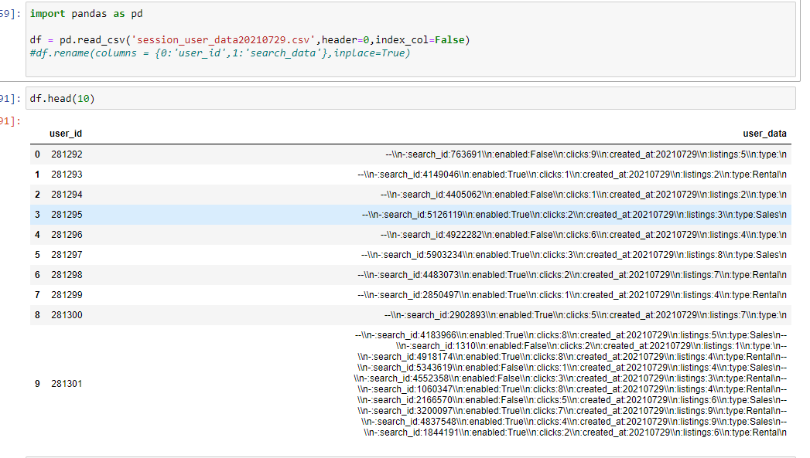


**Data Description**: The source data resides in S3 `s3://user-incoming-bucket` for each day 
from **2021-07-01** till **2021-07-25**, as shown below:

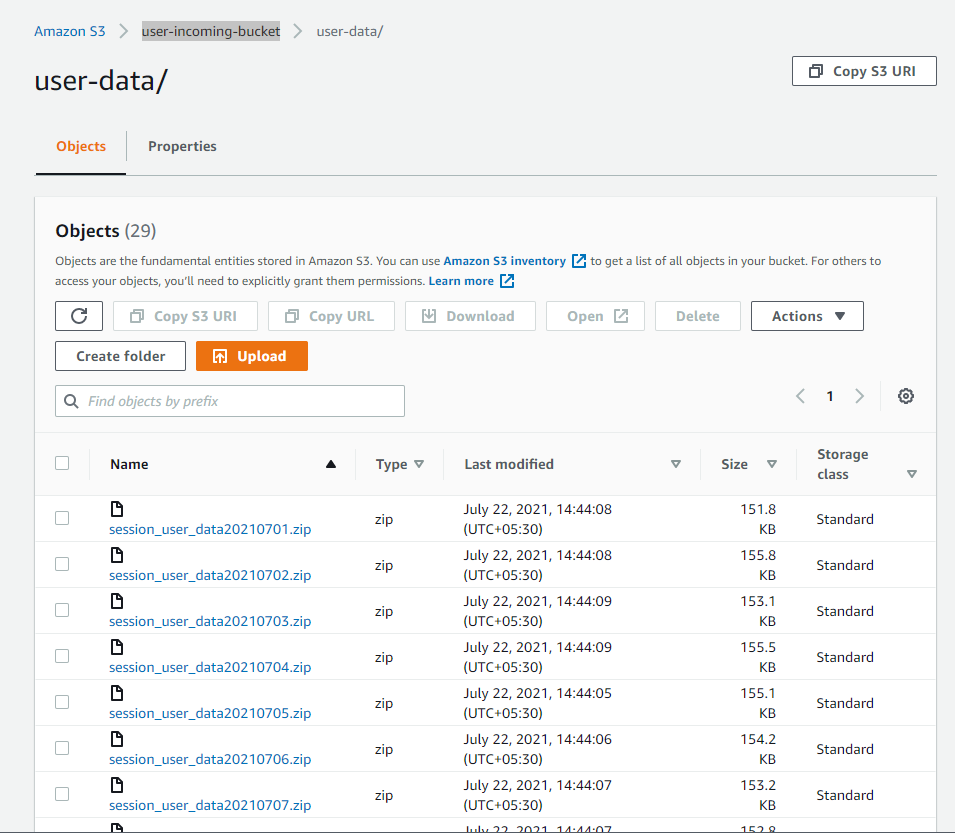

All this data needs to be processed using a data pipeline to answer the following **business questions:**
1. Produce a list of **unique "valid searches"**.
2. Produce, for each date, the **total number of valid searches** that existed on that date.
3. Produce, for each date, the **total number of users** who had valid searches on that date.
4. Given this data, determine which is the **most engaging search.**
5. Report any interesting **trends over the timespan** of the data available.


**Data Pipeline design**:
The design of the pipeline can be summarized as:
- Extract data from source S3 location.
- Process and Transform it using python and custom **Airflow operators**.
- Load a clean dataset and intermediate artifacts to **destination S3 location**.
- Calculate summary statistics and load the summary stats into **Amazon Redshift**.

> Figure showns the structure of the data pipeline as represented by a Airflow DAG
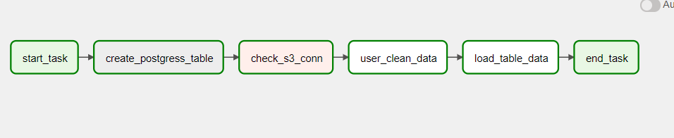

**Design Goals**:
As the data is stored in S3, we need a way to incrementally load each file, then process it and store that particular day's results back into S3. Doing so will allow us to perform further analysis later-on, on the cleaned dataset. 
Secondly, we need a way to aggregate the data and store it in a table to facilitate 
time-based analysis. Keeping these two goals in mind, the following tools were chosen:

- Apache Airflow will incrementally extract the data from S3 and process it and store the results back into a destination S3 bucket.
- Amazon Redshift is a simple cloud-managed data warehouse that can be integrated into pipelines without much effort. Airflow will then read the intermediate dataset created in the first step and aggregate the data per day and store it into a Redshift table.

**Pipeline Implementation**:
Apache Airflow is a Python framework for programmatically creating workflows in DAGs, e.g. ETL processes, generating reports, and retraining models on a daily basis. The Airflow UI automatically parses our DAG and creates a natural representation for the movement and transformation of data. A DAG simply is a collection of all the tasks you want to run, organized in a way that reflects their relationships and dependencies. A **DAG** describes *how* you want to carry out your workflow, and **Operators** determine *what* actually gets done.

By default, airflow comes with some simple built-in operators like `PythonOperator`, `BashOperator`, `DummyOperator` etc., however, airflow lets you extend the features of a `BaseOperator` and create custom operators. For this project, I developed two custom operators:

- s3-user-clean-operator - Operator to download s3 source file data , massage the data and load data back into s3 destination.
- load-stats-redshift-operator - Operator to download s3 file written by step 1 , aggregate the data and load into redshift table `search_stats`


Here's the directory organization:


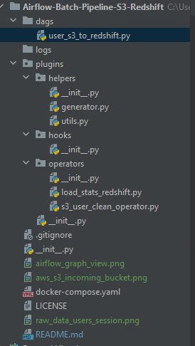


**Pipeline Schedule**: Our pipeline is required to adhere to the following guidelines:
* The DAG should run *daily* from `2021-07-02` to `2021-07-24`
* The DAG should not have any dependencies on past runs.
* On failure, the task is retried for 3 times.
* Retries happen every 5 minutes.
* Do not email on retry.

**Pre-requisite setup for the project**:
- Docker and docker-compose must be running on your laptop. You can get
  latest docker file from [here](https://airflow.apache.org/docs/apache-airflow/stable/start/docker.html).
  
  Snapshot of airflow container running on my local machine 

  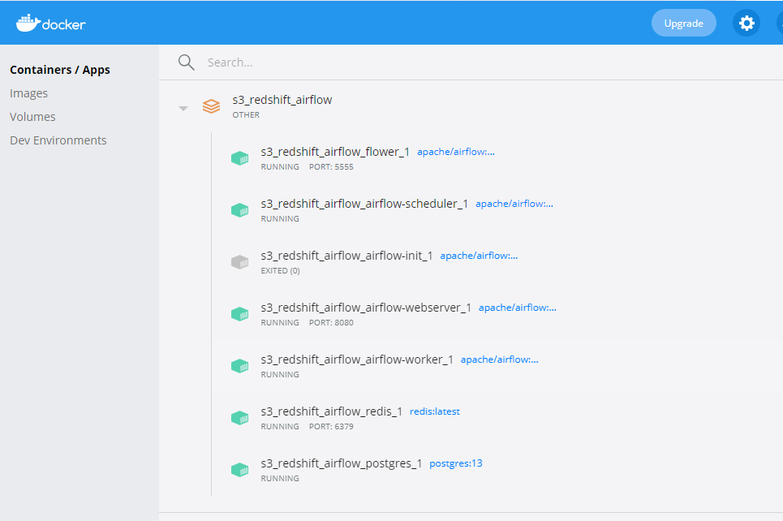

- You have AWS credentials for AWS (user and access key-id ) to connect to S3 and Redshift
- You need to have AWS Redshift cluster setup, we would be using the Endpoint of this 
  cluster in our pipeline to communicate with the Redshift database. Ensure that your VPC
  and security-group settings allow your local machine to be able to communicate to the cluster
  by whitelisting your IP.
 
  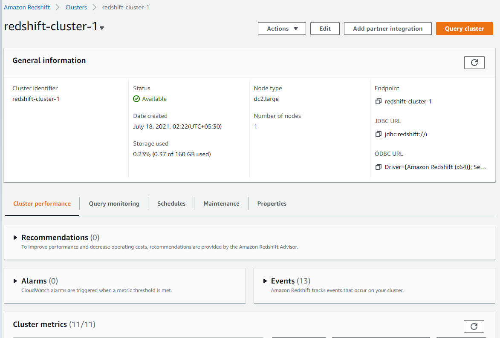 


**Step 1:** Once the requirements are met, launch Airflow on your laptop by running: `docker-compose up` from the location where `docker-compose.yml` is located.
```bash
airflow-webserver_1  |  ____    |__( )_________  __/__  /________      __
airflow-webserver_1  | ____  /| |_  /__  ___/_  /_ __  /_  __ \_ | /| / /
airflow-webserver_1  | ___  ___ |  / _  /   _  __/ _  / / /_/ /_ |/ |/ /
airflow-webserver_1  |  _/_/  |_/_/  /_/    /_/    /_/  \____/____/|__/
airflow-webserver_1  | [2021-07-25 05:29:35,307] {dagbag.py:496} INFO - Filling up the DagBag from /dev/null
airflow-webserver_1  | [2021-07-25 05:30:08 +0000] [62] [INFO] Starting gunicorn 20.1.0
airflow-webserver_1  | [2021-07-25 05:30:08 +0000] [62] [INFO] Listening at: http://0.0.0.0:8080 (62)
airflow-webserver_1  | [2021-07-25 05:30:08 +0000] [62] [INFO] Using worker: sync
airflow-webserver_1  | [2021-07-25 05:30:08 +0000] [66] [INFO] Booting worker with pid: 66
airflow-webserver_1  | [2021-07-25 05:30:08 +0000] [67] [INFO] Booting worker with pid: 67
airflow-webserver_1  | [2021-07-25 05:30:08 +0000] [68] [INFO] Booting worker with pid: 68
airflow-webserver_1  | [2021-07-25 05:30:08 +0000] [69] [INFO] Booting worker with pid: 69
airflow-webserver_1  | ------done--------
airflow-webserver_1  | 127.0.0.1 - - [25/Jul/2021:05:30:59 +0000] "GET /health HTTP/1.1" 200 187 "-" "curl/7.64.0"
airflow-webserver_1  | 172.18.0.1 - - [25/Jul/2021:05:30:59 +0000] "GET / HTTP/1.1" 302 217 "-" "Mozilla/5.0 (Windows NT 10.0; Win64; x64) AppleWebKit/537.36 (KHTML, like Gecko) Chrome/91.0.4472.164 Safari/537.36"
airflow-webserver_1  | ------done--------
airflow-webserver_1  | 172.18.0.1 - - [25/Jul/2021:05:31:00 +0000] "GET / HTTP/1.1" 302 217 "-" "Mozilla/5.0 (Windows NT 10.0; Win64; x64) AppleWebKit/537.36 (KHTML, like Gecko) Chrome/91.0.4472.164 Safari/537.36"
airflow-webserver_1  | 127.0.0.1 - - [25/Jul/2021:05:31:00 +0000] "GET /health HTTP/1.1" 200 187 "-" "curl/7.64.0"
airflow-webserver_1  | 127.0.0.1 - - [25/Jul/2021:05:31:00 +0000] "GET /health HTTP/1.1" 200 187 "-" "curl/7.64.0"
airflow-webserver_1  | ------done--------
airflow-webserver_1  | 172.18.0.1 - - [25/Jul/2021:05:31:00 +0000] "GET / HTTP/1.1" 302 217 "-" "Mozilla/5.0 (Windows NT 10.0; Win64; x64) AppleWebKit/537.36 (KHTML, like Gecko) Chrome/91.0.4472.164 Safari/537.36"
airflow-webserver_1  | 172.18.0.1 - - [25/Jul/2021:05:31:01 +0000] "GET /graph?dag_id=user-s3-to-redshift HTTP/1.1" 200 11436 "-" "Mozilla/5.0 (Windows NT 10.0; Win64; x64) AppleWebKit/537.36 (KHTML, like Gecko) Chrome/91.0.4472.164 Safari/537.36"
airflow-webserver_1  | 172.18.0.1 - - [25/Jul/2021:05:31:01 +0000] "GET /home HTTP/1.1" 200 281181 "-" "Mozilla/5.0 (Windows NT 10.0; Win64; x64) AppleWebKit/537.36 (KHTML, like Gecko) Chrome/91.0.4472.164 Safari/537.36"
airflow-webserver_1  | 172.18.0.1 - - [25/Jul/2021:05:31:01 +0000] "GET /static/appbuilder/css/bootstrap.min.css HTTP/1.1" 304 0 "http://localhost:8080/home" "Mozilla/5.0 (Windows NT 10.0; Win64; x64) AppleWebKit/537.36 (KHTML, like Gecko) Chrome/91.0.4472.164 Safari/537.36"
airflow-webserver_1  | 172.18.0.1 - - [25/Jul/2021:05:31:01 +0000] "GET /static/appbuilder/select2/select2.css HTTP/1.1" 304 0 "http://localhost:8080/home" "Mozilla/5.0 (Windows NT 10.0; Win64; x64) AppleWebKit/537.36 (KHTML, like Gecko) Chrome/91.0.4472.164 Safari/537.36"
```


**Step 2:**: Check Airflow UI 
Login to Airflow Console: http://localhost:8080/admin 

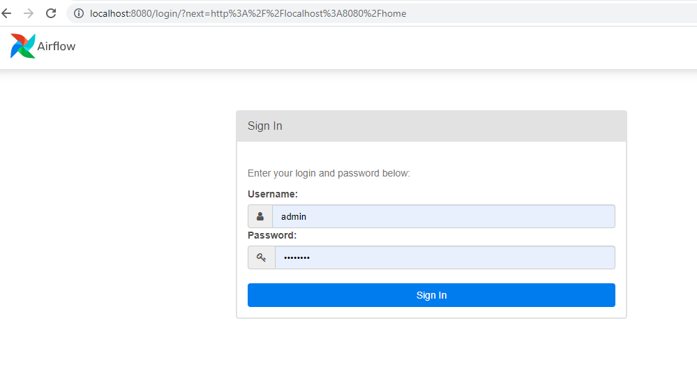


**Step 3:**: Check Airflow UI 
Login to Airflow Console: http://localhost:8080/admin , and create the below three variables

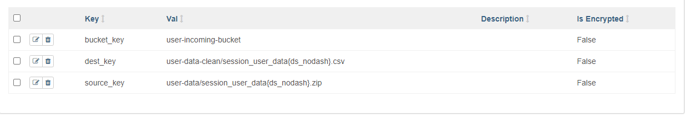

Next, create the following connections:
- *aws_conn*: (Type: Amazon Web Services, Login:<user-id>, Password:<user-access-key>)
- *redshift*: (Type: Postgress, Host:<Redshift-End-Point>, Schema:<Schema>, Login:<user-id>, 
  Password: <Password>, Port: <Port>)

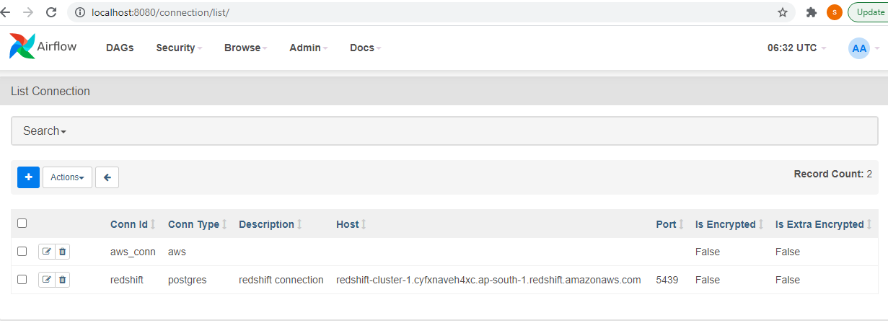


**Step 3**: Create the following connections

**Step 4**: Launch the jupyter notebook provided here: [notebook](https://github.com/shravan-kuchkula/batch-etl/blob/16986034763616f330d27febf22c92efa007d1db/Report/Report_Shravan_Kuchkula.ipynb) . Navigate to "Answering Business questions using data" section. Run the code cells.


** Pipeline Execution


> Data pipeline execution starting on **2021-07-02** and ending on **2021-07-24**.
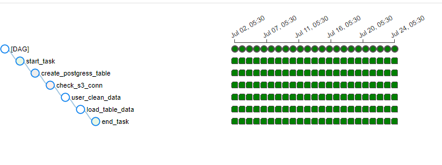


**Destination S3 datasets and Redshift Table**:
After each successful run of the DAG, two files are stored in the destination bucket:
* `s3://user-incoming-bucket/user-data-clean/session_user_data<yyyymmdd>.csv`: Contains a dataset with the following fields:
    * user_id: Unique id of the user *
    * user_data: User Search Data *
    * valid_search_data: Eligible Search Data *
    * num_eligible_searches: Number of Eligible searches *
    * avg_listings: Avg number of listings for that user *
    * type_of_search: Did the user search for: *
        * num_rental_search_type *
        * num_sale_search_type *
        * none_search_type *


##Sample data snapshot from Jupyter notebook

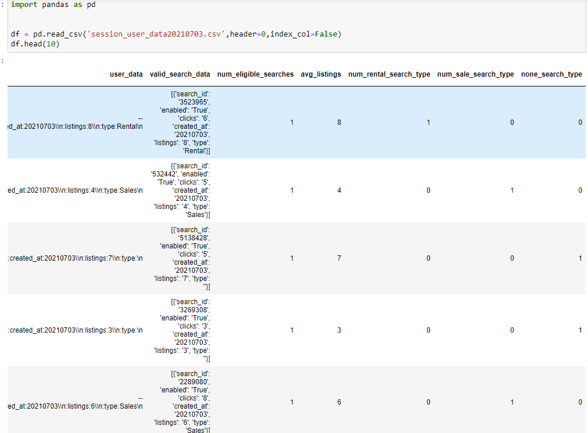

##Destination S3 files

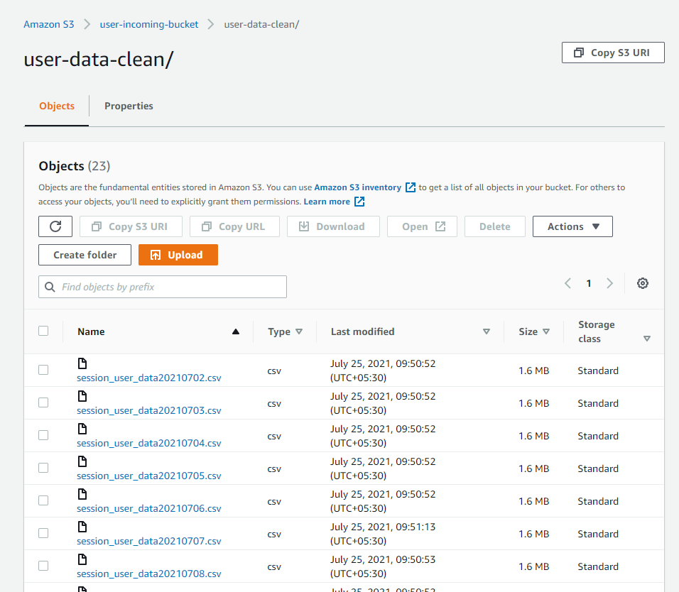


**Amazon Redshift table:**

Below shows snapshot of redshift table `search_stats` after completion of data pipeline

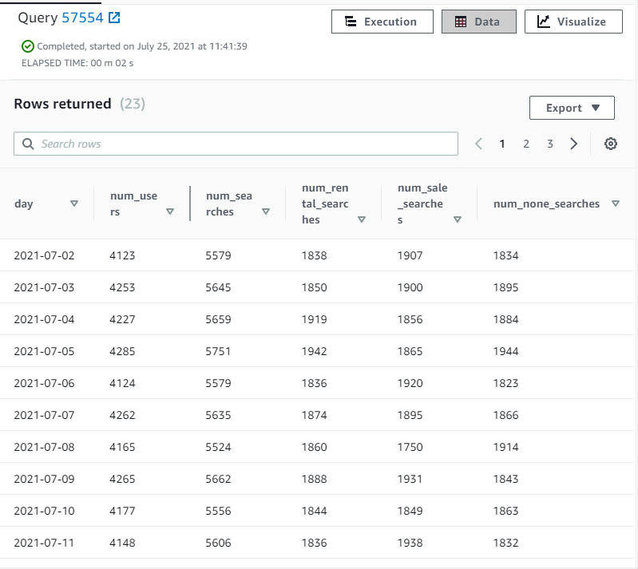


## Business question
Above we have got our data-pipeline process in place to get data extracted and ready to be inferred in 
a redshift table. I am going to extract the data from my Jupyter notebook and do some plotting 
to analyze if any specific pattern emerge from the user search session data.

The below code snippets are taken from jupyte notbook placed under the `notebook` folder 
under in this repo

1) Load data from redshift into pandas dataframe

```
import boto3
import psycopg2
import pandas as pd
client = boto3.client(service_name='redshift',
                      region_name='ap-south-1')

conn = psycopg2.connect(host = 'xyz',
                port = '5439',
                user = 'awsuser',
                password = 'xyz',
                database = 'dev'
                )

cursor = conn.cursor()
cursor.execute("select * from public.search_stats order by day")
results = cursor.fetchall()
df = pd.DataFrame(results)

df.columns = ['day','num_users','num_searches','num_rental_searches','num_sale_searches','num_none_searches']
 
```


2) Data Snapshot

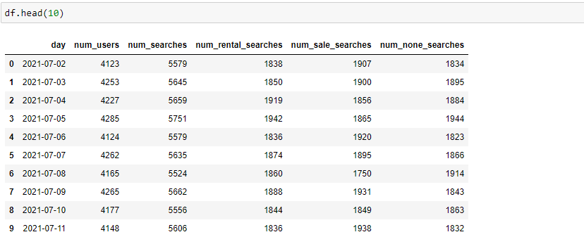


3) Traffic on website 

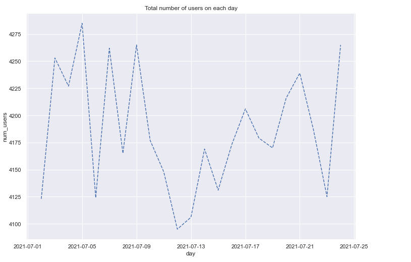

Observation - It can be generalized that the traffic seems to be increasing around end of the week days (starting from Thu,Fri) 
              and post that we see a dip during the weekdays in the site traffic. Most interesting aspect in the traffic distribution is
              around 12/july (second week) when we see a sudden dip in site traffic which needs to be investigated further.


4) Eligible Search Patterns

```
import matplotlib.pyplot as plt
import seaborn as sns
sns.set(rc={'figure.figsize':(11.7,8.27)})
ax = sns.lineplot(x="day", y="num_searches",
             data=df)
ax.lines[0].set_linestyle("--")

plt.title('Total number of searches on each day')
plt.show()

```

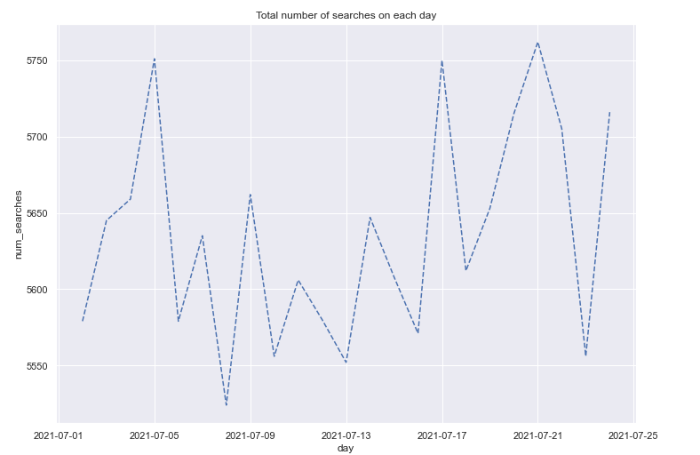


Observation - Around second week of july we see a dip in number of searches which is coherent with the findings in the user
              distribution graph.Also can see a spike in number of searches on - 5,17,21 July.


5) Compare type of searches on the platform - what kind of properties are customers more interested in


```
ax = df[['num_rental_searches', 
         'num_sale_searches', 
         'num_none_searches']].plot(figsize=(12, 8), fontsize=12, linewidth=2, linestyle='--')
ax.set_xlabel('day', fontsize=16)
ax.set_ylabel('Valid Searches', fontsize=16)
ax.set_title('Types of searches every day')
ax.legend(fontsize=10)
plt.show()
```

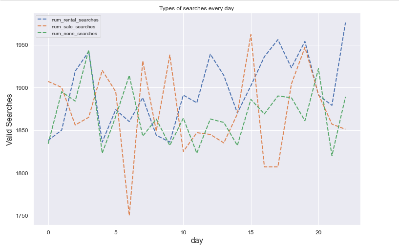


Observation - From the distribution can infer that Rental searches are more engaging on the platform and attracting more users
              Also can infer that users are specific on the search type filter i.e choosing either 'Sale' Or 'Rent' on the search settings 
              this can be inferred from 'none-type' search distribution on the graph